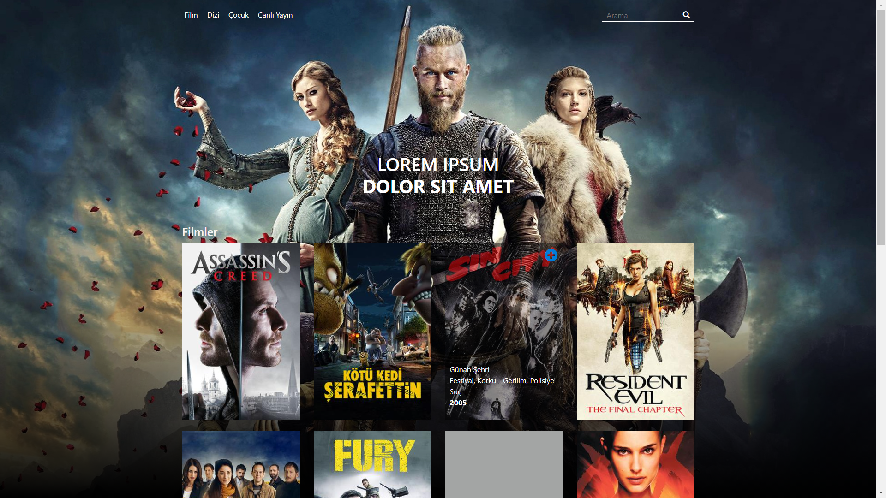

# Movies App with React

## Definitions
This project use simple api.
 
Menu names and product details get their values from api
 
Every product has thumbnail image, film name, released date and category and this values getting from api.

## Run the project

After installing project,
In the project directory, you can run:

### `npm start`

Runs the app in
[http://localhost:3000](http://localhost:3000)

## Demo

